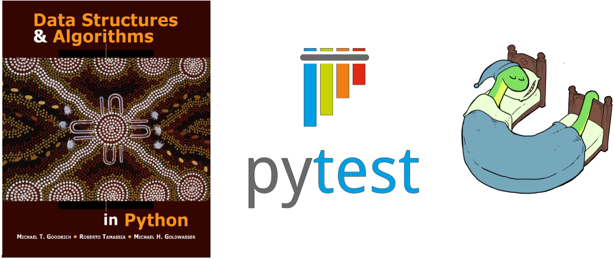
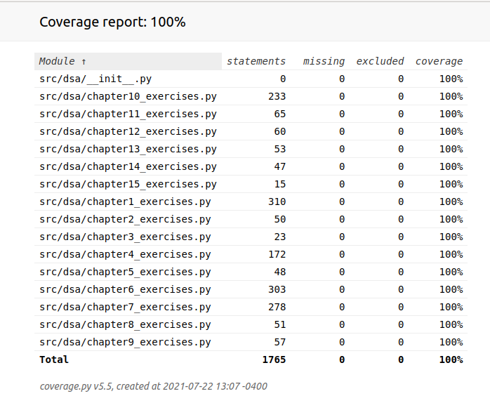
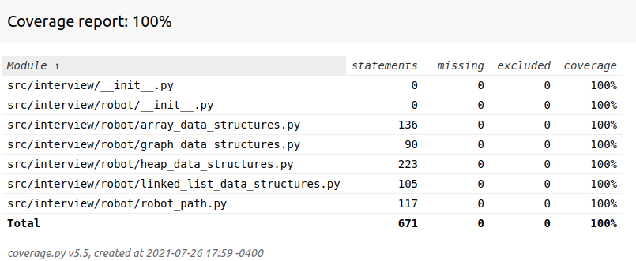

# Data Structures & Algorithms in Python

<p align="center">

</p>

## Overview

This repo contains solutions to selected exercises from the text [Data Structures and Algorithms in Python](https://www.wiley.com/en-us/Data+Structures+and+Algorithms+in+Python-p-9781118290279) by Goodrich, Tamassia, and Goldwasser.  All solutions are unit tested using [pytest](https://docs.pytest.org/en/6.2.x/contents.html) with 100% code [coverage](https://coverage.readthedocs.io/en/coverage-5.5/index.html).

I wrote the code in Python 3.9 and used `pytest` with the [pytest-cov](https://pytest-cov.readthedocs.io/en/latest/) plugin to test my solutions and check code coverage.  The repo is structured as a simple Python package that can be installed in editable mode using `pip`.  A **requirements.txt** file is included for convenience.

## DS-A_Python Contents

The DS-A_Python package has a standard directory structure with source code contained in the `src/` directory and unit tests contained in the `tests/` directory.  Some other files of interest include:

- **pytest.ini:** Settings for `pytest`.  I registered markers to ensure that typos in the marker names don't cause issues.
- **pylint.rc:** Settings for `pylint`.  I added a number of exceptions so that `pylint` doesn't ding my code for things like variable names (specified by the textbook) that violate the snake_case style.
- **gitignore:** Ignore HTML generated by pytest-cov, as well as various files generated by VS Code and egg files generated from installing the `dsa` package.
- **setup.py:** Needed to install local package `dsa`.

The `src/` directory contains three directories.  The solutions to the exercises are contained within `dsa/`, while some source code from the [textbook's GitHub repo](https://github.com/mjwestcott/Goodrich) (with license) is contained in the `textbook_src/` directory.  The third directory, `interview/` consists of solutions to interview questions or exercises relevant to data structures and algorithms.

## Testing with `pytest`
`pytest` comes out of the box with powerful and easy-to-use features like test parameterization and test fixtures.  It also requires less boilerplate code than the `unittest` unit testing framework included in the Python standard library.  My secondary goal for working through *Data Structures and Algorithms in Python* was to become more familiar with`pytest`and software testing in general.  I learned how to parameterize tests, create my own custom test fixtures, mock Python built-ins, and use`pytest` plugins like `pytest-cov` to measure the code coverage of my tests.


### `pytest-cov`
I measured the code coverage of my Python source code using a `pytest`plugin called `pytest-cov`.  This plugin allows the user to generate code coverage reports directly from `pytest`.

The results from `pytest-cov` can be printed to the terminal, or saved to HTML and viewed in a web browser.  An example image of the HTML generated after a `pytest-cov` run is shown below:

<p align="center">

</p>

I prefer to view the results in the web browser, as the source code for each tested file can be viewed by clicking on the link in the report.  All untested statements in the code are highlighted in red and easy to locate.


### Useful `pytest` Commands and Syntax

The following is a brief overview of the commands and syntax that I used most often when writing the unit tests in this repo.  Statements preceded by `$` indicate terminal commands; all other statements are Python code unless specified otherwise.

- Run all tests in repo (all packages) in verbose mode

`$ pytest -v`

- Run all tests in the interview package in verbose mode

`pytest -v tests/unit/interview/`

- Run all tests in a module in verbose mode

`$ pytest -v tests/unit/exercises/test_chapter4.py`

- Run a specific test and disable stdout capture so that you can view print statements

`$ pytest -v -s tests/unit/exercises/test_chapter4.py::test_os_walk`

- Decorator to mark tests you'd like to skip

`@pytest.mark.skip(reason='Work in progress')`

- View list of registered markers

`$ pytest --markers`

- Run tests with strict markers option to catch marker typos

`$ pytest -v --strict-markers tests/unit/exercises/test_chapter4.py`

- Register markers in pytest.ini file for strict marker mode

```
[pytest]
markers =
    slow: Tests that are slow to execute.
```

- Don't run slow tests marked "slow"

`$ pytest -v --strict-markers -m 'not slow' tests/unit/exercises/test_chapter4.py`

#### Checking coverage:

- Run coverage over entire source directory, including source code that no tests have been written for

`$ pytest --cov=src`

- Run coverage over entire source directory and save report to HTML

`$ pytest --cov=src --cov-report=html`

- Tell pytest-cov to run all tests in the `tests/` directory, but only report coverage for tests covering code in the `dsa` package

`$ pytest --cov=dsa tests/ --cov-report=html`

- Tell pytest-cov to only run tests in `tests/unit/exercises/` directory and generate a coverage report for the `dsa` package; tests for other packages (such as `interview`) will not be run

`$ pytest --cov=dsa tests/unit/exercises/ --cov-report=html`

- Tell pytest-cov to only run tests in `tests/unit/interview/` directory and generate a coverage report for the `interview` package; tests for other packages (such as `dsa`) will not be run

`$ pytest --cov=interview tests/unit/interview/ --cov-report=html`

- Run both unit tests and functional tests for the interview package

`$ pytest --cov=interview tests/unit/interview/ tests/func/interview/ --cov-report=html`


## Interview Exercises

### Robot Shortest-Path Exercise
I completed a programming exercise to calculate the shortest path between a robot and a goal location, as represented by an ASCII map.  The characters in the map are as follows:

- character '#' (a hashtag symbol) represents an obstacle
- character '.' (a period) represents open space
- character 'R' (a capital R) represents the location of a robot
- character 'G' (a capital G) represents a goal location

The shortest path between 'R' and 'G' is to be represented using 'O' characters and saved to file.

An example map with solution is shown below:

```
##############################################################################
#............................................................................#
#............................................................................#
#............................................................................#
#.............................#########......................................#
#.............................#########....G.................................#
#.............................#########....O.................................#
#.............................#########....O.................................#
#.............................#########....O.....................#############
####..#################################....O.....................#############
####..#################################....O.....................#############
####.......................................O.....................####........#
####.......................................O.....................####........#
#######################################....O.....................####........#
#######################################....O..#######################........#
#######################################....O..####################...........#
..............................#########....O..####################...........#
..............................#########....O..####################...........#
..............................#########....O..####################...........#
..............................#########....O.................................#
..............................#########....O.................................#
..............................#########....O.................................#
..............................#########....O.................................#
...........................................O..............##############.....#
...........................................O..............##############.....#
...........................................O..............##############.....#
..OOOOOOOOOOOOOOOOOOOOOOOOOOOOOOOOOOOOOOOOOO..............##############.....#
..O.......................................................##############.....#
..O.................##############.###########################...............#
..O.................##############.###########################...............#
..O.................##############.#####......################...............#
..O.................##############.#####......################...............#
..O.................##############.#####......################...............#
..O.................##############............####...........................#
..O.................##############............####...........................#
..O.................##############.###############...........................#
..O.................##############..##############...........................#
..O.................##############...#############...........................#
..O.................###############......#########..........###########......#
..O.................###################..#########..........###########......#
..O.................####################..########..........###########......#
..O.................#####################.########..........###########......#
..O.................#####################.########..........###########......#
..O.................##################### ########..........###########......#
..O.........................................................###########......#
..O.........................................................###########......#
..O.........................................................###########......#
..O.....................................................###############......#
..O.....................................................###############......#
..O.....................................................###############......#
#.O.....................................................###############......#
#.O.....................................................###############......#
#.O.....................................................###############......#
#.O..........................................................................#
#.O..........................................................................#
#.O..........................................................................#
#.O..........................................................................#
#.R..........................................................................#
#............................................................................#
#............................................................................#
#............................................................................#
#............................................................................#
#............................................................................#
#............................................................................#
#####################..........................###############################
```

I performed the following steps to solve this exercise:

1. Read in the ASCII map
2. Assigned the characters of the map to vertices in a weighted graph G
3. Ran Djikstra's algorithm on G for the vertex containing the robot
4. Computed the shortest-path tree from the resulting distance map
5. Modified the ASCII map to show the robot's path to the goal and wrote to disk

I wrote all of the classes used to implement this solution from scratch:
1. A Graph class implemented using an adjacency map
    a. A nested Vertex class for the Graph
    b. A nested Edge class for the Graph
    c. A Map class implemented using a hash table for the adjacency map
    d. A nested Item class for the Map
2. An AdaptablePriorityQueue class implemented using a heap
    a. A nested Item class for the AdaptablePriorityQueue
    b. A Heap class
    c. A BinaryTree class to implement the Heap class
    d. A nested Node class for the BinaryTree
    e. A circular queue to implement BFS for the binary tree

All of the data structures were unit-tested.  I performed functional testing of the solution itself by creating a series of small ASCII test maps and their shortest-path solutions.  These test maps were input into the solver, and the result was compared to the solution files.  The resulting code passes all tests with 100% code coverage:

<p align="center">

</p>

The test files used for functional testing are contained in `tests/func/interview/robot/test_robot_path`.  Once my code passed all tests I then ran the solver on several full-sized ASCII maps.  These maps (and their solutions) are located in `src/interview/robot/data`.
